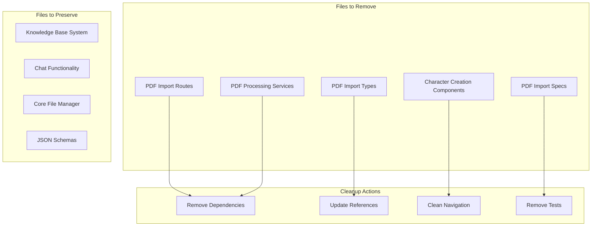

# Design Document

## Overview

The Character Creation Revamp is a complete removal of all existing character creation functionality, including both PDF import systems and manual character creation wizards. This is a cleanup-focused design that eliminates all character creation logic from the codebase, leaving only the core knowledge base file management and chat functionality intact.

The design focuses on thorough code removal, dependency cleanup, and ensuring no broken references remain after the deletion process. No replacement functionality will be implemented as part of this effort.

## Removal Architecture

## Files and Components to Remove

### Backend Files to Delete

#### 1. PDF Import System Files
- `web_app/pdf_import_routes.py` - All PDF import API endpoints
- `web_app/pdf_import_session_manager.py` - PDF import session management
- `web_app/pdf_upload_validator.py` - PDF file validation logic
- `web_app/vision_character_parser.py` - GPT-4.1 vision parsing service
- `web_app/pdf_image_converter.py` - PDF to image conversion service

#### 2. Character Creation API Routes
- Any character creation endpoints in existing route files
- Character creation request/response models in `web_app/models.py`
- Character creation service classes and methods

#### 3. Dependencies to Remove from requirements.txt
- `pdf2image` - PDF to image conversion
- `PyPDF2` - PDF text extraction (if present)
- `pdfplumber` - PDF parsing (if present)
- `pillow` - Image processing (if only used for PDF)
- Any other PDF-specific dependencies

### Frontend Files to Delete

#### 1. PDF Import Components
- All PDF import React components and pages
- PDF import service files (`frontend-src/services/pdfImportApi.ts`)
- PDF import type definitions in `frontend-src/types/index.ts`

#### 2. Character Creation Components
- Any existing character creation wizard components
- Character creation form components
- Character creation service calls

#### 3. Navigation and Routing Updates
- Remove PDF import from navigation menus
- Remove PDF import routes from routing configuration
- Update navigation store to remove PDF import state

### Documentation and Specs to Remove

#### 1. Specification Directories
- `.kiro/specs/pdf-character-import/` - Complete directory removal
- `.kiro/specs/pdf-vision-modernization/` - Complete directory removal

#### 2. Test Files
- Any PDF import related test files
- Character creation test files
- Integration tests for removed functionality

## Preserved Components

### Core Systems to Keep Intact

#### 1. Knowledge Base File Management
- `web_app/knowledge_base_service.py` - Core file operations (keep existing functionality)
- `web_app/knowledge_base_routes.py` - File CRUD operations (remove only character creation endpoints)
- JSON schema validation and loading systems

#### 2. Chat System
- All chat-related functionality remains unchanged
- Character data reading for chat context (no creation, just reading existing files)

#### 3. JSON Schema Structure
- `knowledge_base/character-json-structures/` - All schema files remain
- Existing character JSON files in `knowledge_base/characters/` remain untouched

### Reference Cleanup Required

#### 1. Main Application Updates
- Remove PDF import service initialization from `web_app/main.py`
- Remove PDF import route registration
- Remove character creation route registration
- Clean up any global dependencies or imports

#### 2. Model Updates
- Remove PDF import models from `web_app/models.py`
- Remove character creation request/response models
- Keep only models used by preserved functionality

## Cleanup Verification

### Ensuring Complete Removal

#### 1. Code Reference Checks
- Search codebase for any remaining references to removed files
- Update import statements that reference deleted modules
- Remove unused imports and dependencies
- Clean up any configuration references

#### 2. API Endpoint Verification
- Ensure no broken API routes remain
- Remove route registrations for deleted endpoints
- Update API documentation if it exists
- Verify no frontend calls to removed endpoints

#### 3. Type Definition Cleanup
- Remove TypeScript interfaces for deleted functionality
- Clean up type imports and exports
- Update any union types that included removed types
- Ensure no broken type references remain

## Post-Cleanup Testing

### Verification Tests

#### 1. System Functionality Tests
- **Knowledge Base Operations** - Verify file reading/editing still works
- **Chat System** - Ensure chat can still read existing character files
- **API Health** - Verify remaining API endpoints function correctly
- **Frontend Navigation** - Ensure UI navigation works without removed components

#### 2. Dependency Tests
- **Import Verification** - Ensure no broken imports remain
- **Dependency Loading** - Verify application starts without removed dependencies
- **Route Testing** - Test that remaining routes work correctly
- **Error Handling** - Ensure graceful handling of removed functionality

#### 3. Data Integrity Tests
- **Existing Characters** - Verify existing character files remain accessible
- **Schema Validation** - Ensure schema loading still works
- **File Operations** - Test reading/writing of existing character data
- **Backup Verification** - Ensure no data loss during cleanup

## Cleanup Strategy

### Phase 1: Backend File Removal
1. **Delete PDF Import Files** - Remove all PDF processing service files
2. **Clean Dependencies** - Remove PDF processing libraries from requirements.txt
3. **Update Main Application** - Remove service registrations and route imports
4. **Clean Models** - Remove PDF import and character creation models

### Phase 2: Frontend File Removal
1. **Delete PDF Components** - Remove all PDF import React components
2. **Update Navigation** - Remove PDF import from menus and routing
3. **Delete Services** - Remove PDF import API service files
4. **Update State Management** - Remove PDF import from navigation store

### Phase 3: Documentation and Spec Cleanup
1. **Remove Old Specs** - Delete pdf-character-import and pdf-vision-modernization spec directories
2. **Update Documentation** - Remove PDF import references from README and other docs
3. **Clean Test Files** - Remove all PDF import and character creation test files
4. **Update Comments** - Remove outdated code comments and documentation

### Phase 4: Reference Cleanup and Verification
1. **Fix Broken Imports** - Update any remaining references to deleted files
2. **Clean Type Definitions** - Remove unused TypeScript types and interfaces
3. **Verify System Health** - Ensure application starts and core functionality works
4. **Test Remaining Features** - Verify knowledge base and chat systems still function

## Data Preservation

### Existing Character Data Protection
- **No Character File Changes** - Existing character JSON files remain completely untouched
- **Schema Preservation** - All JSON schemas in `character-json-structures/` remain intact
- **Knowledge Base Structure** - Directory structure and file organization unchanged
- **Backup Recommendation** - Suggest backing up character data before cleanup (optional safety measure)

### System Continuity
- **Chat System Compatibility** - Ensure chat can still read existing character files for context
- **File Manager Preservation** - Keep core file reading/editing capabilities intact
- **API Compatibility** - Preserve any APIs that read existing character data
- **Schema Validation** - Maintain schema loading and validation for existing files

## Post-Cleanup State

### What Remains After Cleanup
- **Core Knowledge Base System** - File management and editing capabilities
- **Chat Functionality** - AI chat with character context from existing files
- **JSON Schema System** - Schema loading and validation infrastructure
- **Existing Character Data** - All previously created character files
- **File Operations** - Basic file CRUD operations for character data

### What Is Completely Removed
- **PDF Import System** - All PDF processing and vision parsing
- **Character Creation Wizards** - Any guided character creation interfaces
- **Character Creation APIs** - Endpoints for creating new characters
- **PDF Dependencies** - All PDF processing libraries and services
- **Creation UI Components** - All character creation frontend components

### Future Development Path
- **Clean Slate** - Future character creation can be built from scratch
- **Preserved Foundation** - Core file management and schema systems remain for future use
- **No Legacy Constraints** - No old character creation code to work around
- **Flexible Architecture** - Future implementations can take any approach without legacy limitations