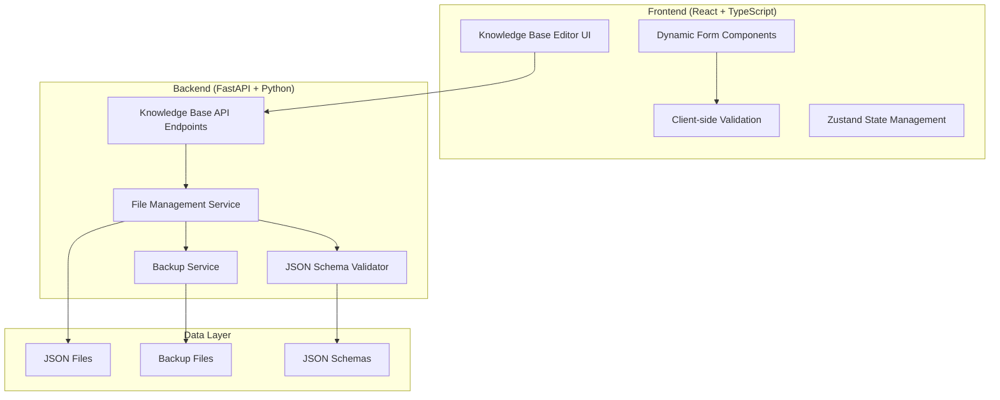

# Design Document

## Overview

The Knowledge Base Editor will extend the existing ShadowScribe web application to provide comprehensive editing capabilities for D&D character data. The system will integrate seamlessly with the current FastAPI backend and React frontend, adding new API endpoints for file management and new UI components for editing complex JSON structures.

The design maintains the existing architecture patterns while adding specialized components for handling the nested JSON structures found in character data, backgrounds, and feats. The system will provide real-time validation, backup mechanisms, and an intuitive editing experience that preserves data integrity.

## Architecture

### System Architecture Overview



### Integration with Existing System

The Knowledge Base Editor will integrate with the current ShadowScribe architecture by:

- **Extending the existing FastAPI router** with new `/knowledge-base` endpoints
- **Adding new React components** to the existing component structure
- **Utilizing the current state management** patterns with Zustand
- **Following the established API patterns** for error handling and responses
- **Maintaining the existing WebSocket connection** for real-time updates

## Components and Interfaces

### Backend Components

#### 1. Knowledge Base API Router (`/api/knowledge-base`)

**Endpoints:**
- `GET /files` - List all knowledge base files
- `GET /files/{filename}` - Get specific file content
- `PUT /files/{filename}` - Update file content
- `POST /files` - Create new file
- `DELETE /files/{filename}` - Delete file (with confirmation)
- `POST /validate/{filename}` - Validate file structure
- `GET /schema/{file_type}` - Get JSON schema for file type
- `POST /character/new` - Create new character with all associated files
- `GET /templates/{file_type}` - Get template for creating new files

#### 2. File Management Service

```python
class KnowledgeBaseFileManager:
    def __init__(self, knowledge_base_path: str):
        self.base_path = knowledge_base_path
        self.backup_service = BackupService()
        self.validator = JSONSchemaValidator()
    
    async def read_file(self, filename: str) -> dict
    async def write_file(self, filename: str, content: dict) -> bool
    async def create_file(self, filename: str, content: dict) -> bool
    async def delete_file(self, filename: str) -> bool
    async def list_files(self) -> List[FileInfo]
    async def validate_content(self, content: dict, file_type: str) -> ValidationResult
```

#### 3. JSON Schema Validator

```python
class JSONSchemaValidator:
    def __init__(self):
        self.schemas = self._load_schemas()
    
    def validate_character(self, data: dict) -> ValidationResult
    def validate_character_background(self, data: dict) -> ValidationResult
    def validate_feats_and_traits(self, data: dict) -> ValidationResult
    def validate_action_list(self, data: dict) -> ValidationResult
    def validate_inventory_list(self, data: dict) -> ValidationResult
    def validate_objectives_and_contracts(self, data: dict) -> ValidationResult
    def validate_spell_list(self, data: dict) -> ValidationResult
    def get_schema(self, file_type: str) -> dict
```

#### 4. Backup Service

```python
class BackupService:
    def create_backup(self, filename: str, content: dict) -> str
    def restore_backup(self, backup_id: str) -> dict
    def list_backups(self, filename: str) -> List[BackupInfo]
    def cleanup_old_backups(self, max_age_days: int = 30)
```

### Frontend Components

#### 1. Knowledge Base Editor Container

```typescript
interface KnowledgeBaseEditorProps {
  onClose: () => void;
}

export const KnowledgeBaseEditor: React.FC<KnowledgeBaseEditorProps>
```

#### 2. File Browser Component

```typescript
interface FileBrowserProps {
  files: KnowledgeBaseFile[];
  onFileSelect: (file: KnowledgeBaseFile) => void;
  onCreateNew: () => void;
}

export const FileBrowser: React.FC<FileBrowserProps>
```

#### 3. Dynamic Form Generator

```typescript
interface DynamicFormProps {
  schema: JSONSchema;
  data: any;
  onChange: (data: any) => void;
  onValidate: (errors: ValidationError[]) => void;
}

export const DynamicForm: React.FC<DynamicFormProps>
```

#### 4. Character Creation Wizard

```typescript
interface CharacterCreationWizardProps {
  onComplete: (character: CharacterData) => void;
  onCancel: () => void;
}

export const CharacterCreationWizard: React.FC<CharacterCreationWizardProps>
```

#### 5. Specialized Editors

- **CharacterBasicEditor** - Basic character information (character.json)
- **BackgroundEditor** - Character background and story (character_background.json)
- **FeatsTraitsEditor** - Complex nested abilities and features (feats_and_traits.json)
- **ActionListEditor** - Character actions and abilities (action_list.json)
- **InventoryEditor** - Equipment and items management (inventory_list.json)
- **ObjectivesEditor** - Quests and contracts tracking (objectives_and_contracts.json)
- **SpellListEditor** - Spell management and details (spell_list.json)
- **ArrayEditor** - Generic component for editing arrays with add/remove/reorder
- **NewCharacterWizard** - Multi-step wizard for creating all character files

## Data Models

### API Models

```python
class KnowledgeBaseFile(BaseModel):
    filename: str
    file_type: str  # 'character', 'character_background', 'feats_and_traits', 'action_list', 'inventory_list', 'objectives_and_contracts', 'spell_list', 'other'
    size: int
    last_modified: datetime
    is_editable: bool

class FileContent(BaseModel):
    filename: str
    content: Dict[str, Any]
    schema_version: str

class ValidationResult(BaseModel):
    is_valid: bool
    errors: List[ValidationError]
    warnings: List[str]

class ValidationError(BaseModel):
    field_path: str
    message: str
    error_type: str  # 'required', 'type', 'format', 'custom'

class BackupInfo(BaseModel):
    backup_id: str
    filename: str
    created_at: datetime
    size: int
```

### Frontend Types

```typescript
interface KnowledgeBaseFile {
  filename: string;
  fileType: 'character' | 'character_background' | 'feats_and_traits' | 'action_list' | 'inventory_list' | 'objectives_and_contracts' | 'spell_list' | 'other';
  size: number;
  lastModified: string;
  isEditable: boolean;
}

interface FileContent {
  filename: string;
  content: Record<string, any>;
  schemaVersion: string;
}

interface ValidationError {
  fieldPath: string;
  message: string;
  errorType: 'required' | 'type' | 'format' | 'custom';
}

interface FormField {
  key: string;
  type: 'string' | 'number' | 'boolean' | 'array' | 'object';
  label: string;
  required: boolean;
  validation?: ValidationRule[];
  children?: FormField[];
}
```

## Error Handling

### Backend Error Handling

1. **File Operation Errors**
   - File not found (404)
   - Permission denied (403)
   - Disk space issues (507)
   - Concurrent modification conflicts (409)

2. **Validation Errors**
   - Schema validation failures (400)
   - Required field missing (400)
   - Invalid data types (400)

3. **Backup/Recovery Errors**
   - Backup creation failures (500)
   - Recovery operation failures (500)

### Frontend Error Handling

1. **Network Errors**
   - Connection timeouts
   - Server unavailable
   - API endpoint errors

2. **Validation Errors**
   - Real-time field validation
   - Form submission validation
   - Schema compliance errors

3. **User Experience Errors**
   - Unsaved changes warnings
   - Concurrent editing conflicts
   - Data loss prevention

## Testing Strategy

### Backend Testing

1. **Unit Tests**
   - File management operations
   - JSON schema validation
   - Backup/restore functionality
   - API endpoint responses

2. **Integration Tests**
   - End-to-end file operations
   - Validation workflow
   - Error handling scenarios
   - Concurrent access handling

3. **Performance Tests**
   - Large file handling
   - Multiple concurrent users
   - Backup operation performance

### Frontend Testing

1. **Component Tests**
   - Form rendering and validation
   - User interaction handling
   - State management
   - Error display

2. **Integration Tests**
   - API communication
   - File upload/download
   - Real-time validation
   - Navigation flows

3. **E2E Tests**
   - Complete editing workflows
   - Character creation process
   - Error recovery scenarios
   - Cross-browser compatibility

## Security Considerations

### File Access Control

- **Path Traversal Prevention** - Validate all file paths to prevent access outside knowledge base directory
- **File Type Validation** - Only allow editing of approved JSON file types
- **Size Limits** - Implement reasonable file size limits to prevent abuse
- **Rate Limiting** - Limit API requests per user/session

### Data Validation

- **Schema Enforcement** - Strict JSON schema validation on all file operations
- **Input Sanitization** - Sanitize all user input before processing
- **Backup Integrity** - Verify backup file integrity before restoration
- **Concurrent Access** - Handle multiple users editing the same file safely

### API Security

- **Authentication** - Integrate with existing session management
- **Authorization** - Ensure users can only edit their own files
- **CORS Configuration** - Maintain existing CORS settings
- **Error Information** - Avoid exposing sensitive system information in errors

## Performance Considerations

### Backend Optimization

- **File Caching** - Cache frequently accessed files in memory
- **Lazy Loading** - Load file content only when requested
- **Batch Operations** - Support batch file operations where appropriate
- **Background Tasks** - Perform backup operations asynchronously

### Frontend Optimization

- **Component Lazy Loading** - Load editor components only when needed
- **Form Virtualization** - Handle large forms efficiently
- **Debounced Validation** - Avoid excessive validation calls during typing
- **State Optimization** - Minimize unnecessary re-renders

### Data Transfer

- **Compression** - Compress large JSON payloads
- **Incremental Updates** - Send only changed data when possible
- **Pagination** - Paginate file lists for large knowledge bases
- **WebSocket Updates** - Use existing WebSocket for real-time updates