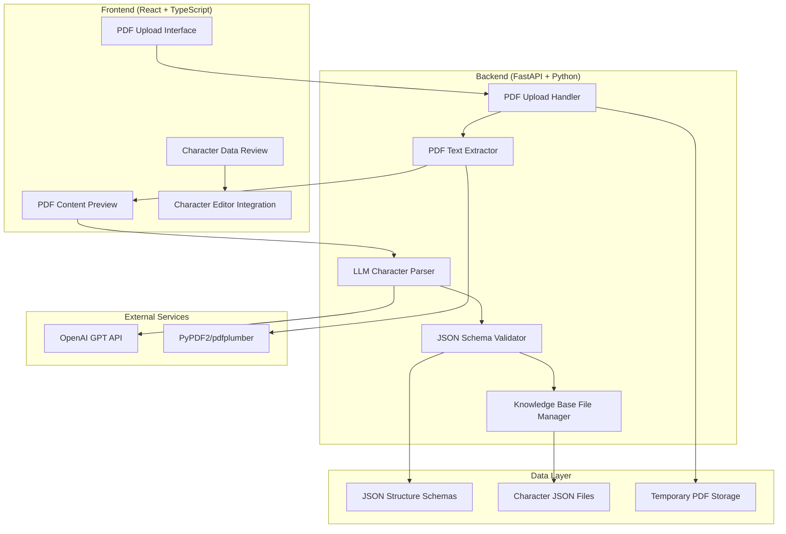

# Design Document

## Overview

The PDF Character Import feature will extend the existing ShadowScribe web application to provide AI-powered character sheet parsing capabilities. Users can upload PDF character sheets from various sources (D&D Beyond exports, Roll20 sheets, handwritten forms, etc.) and have the system intelligently extract character data using LLM processing, then convert it into the standardized JSON structure defined in the `knowledge_base/character-json-structures/` directory.

The design leverages the existing FastAPI backend architecture and React frontend while adding new PDF processing capabilities, LLM integration for data extraction, and seamless integration with the current character management system. All generated character data will conform to the general object-based JSON schemas, ensuring compatibility with existing features.

## Architecture

### System Architecture Overview



### Integration with Existing System

The PDF import feature integrates with the current ShadowScribe architecture by:

- **Extending existing API routes** with new `/api/character/import-pdf` endpoints
- **Reusing the KnowledgeBaseFileManager** for character file creation and validation
- **Leveraging existing JSON schemas** from `character-json-structures/` directory
- **Integrating with the character creation wizard** as an alternative entry point
- **Using the same character editor** for post-import modifications
- **Following established error handling** and validation patterns

## Components and Interfaces

### Backend Components

#### 1. PDF Import API Router (`/api/character/import-pdf`)

**Endpoints:**
- `POST /upload` - Upload PDF file and extract text content
- `POST /parse` - Send extracted text to LLM for character data parsing
- `GET /preview/{session_id}` - Get extracted PDF text for user review
- `POST /generate/{session_id}` - Generate character JSON files from parsed data
- `DELETE /cleanup/{session_id}` - Clean up temporary files and session data

#### 2. PDF Text Extractor Service

```python
class PDFTextExtractor:
    def __init__(self):
        self.supported_formats = ['.pdf']
        self.max_file_size = 10 * 1024 * 1024  # 10MB
    
    async def extract_text(self, file_path: str) -> PDFExtractionResult
    async def validate_pdf(self, file_path: str) -> bool
    def _clean_extracted_text(self, raw_text: str) -> str
    def _detect_pdf_structure(self, text: str) -> PDFStructureInfo
```

#### 3. LLM Character Parser Service

```python
class LLMCharacterParser:
    def __init__(self, openai_client, schema_validator):
        self.client = openai_client
        self.validator = schema_validator
        self.schema_loader = JSONSchemaLoader()
    
    async def parse_character_data(self, pdf_text: str) -> CharacterParseResult
    def _build_parsing_prompts(self) -> Dict[str, str]
    def _validate_parsed_data(self, data: Dict) -> ValidationResult
    def _apply_schema_corrections(self, data: Dict, file_type: str) -> Dict
    def _generate_character_files(self, parsed_data: Dict) -> Dict[str, Dict]
```

#### 4. PDF Import Session Manager

```python
class PDFImportSessionManager:
    def __init__(self, temp_storage_path: str):
        self.temp_path = temp_storage_path
        self.sessions = {}
        self.cleanup_interval = 3600  # 1 hour
    
    async def create_session(self, user_id: str) -> str
    async def store_pdf_content(self, session_id: str, content: bytes) -> str
    async def store_extracted_text(self, session_id: str, text: str)
    async def store_parsed_data(self, session_id: str, data: Dict)
    async def get_session_data(self, session_id: str) -> PDFImportSession
    async def cleanup_session(self, session_id: str)
```

#### 5. JSON Schema Loader and Validator Integration

```python
class JSONSchemaLoader:
    def __init__(self, schema_path: str):
        self.schema_path = Path(schema_path)
        self.schemas = {}
    
    def load_all_schemas(self) -> Dict[str, Dict]
    def get_schema_for_file_type(self, file_type: str) -> Dict
    def get_template_for_file_type(self, file_type: str) -> Dict
    def validate_against_schema(self, data: Dict, file_type: str) -> ValidationResult
```

### Frontend Components

#### 1. PDF Import Wizard Container

```typescript
interface PDFImportWizardProps {
  onComplete: (characterName: string) => void;
  onCancel: () => void;
}

export const PDFImportWizard: React.FC<PDFImportWizardProps>
```

#### 2. PDF Upload Component

```typescript
interface PDFUploadProps {
  onUploadComplete: (sessionId: string, extractedText: string) => void;
  onError: (error: string) => void;
}

export const PDFUpload: React.FC<PDFUploadProps>
```

#### 3. PDF Content Preview Component

```typescript
interface PDFContentPreviewProps {
  extractedText: string;
  onConfirm: () => void;
  onReject: () => void;
  onEdit: (editedText: string) => void;
}

export const PDFContentPreview: React.FC<PDFContentPreviewProps>
```

#### 4. Character Data Review Component

```typescript
interface CharacterDataReviewProps {
  parsedData: ParsedCharacterData;
  uncertainFields: string[];
  onFieldEdit: (filePath: string, fieldPath: string, value: any) => void;
  onFinalize: (characterName: string) => void;
  onReparse: () => void;
}

export const CharacterDataReview: React.FC<CharacterDataReviewProps>
```

#### 5. Import Progress Tracker

```typescript
interface ImportProgressProps {
  currentStep: 'upload' | 'extract' | 'parse' | 'review' | 'finalize';
  progress: number;
  status: string;
}

export const ImportProgress: React.FC<ImportProgressProps>
```

## Data Models

### API Models

```python
class PDFExtractionResult(BaseModel):
    session_id: str
    extracted_text: str
    page_count: int
    structure_info: PDFStructureInfo
    confidence_score: float

class PDFStructureInfo(BaseModel):
    has_form_fields: bool
    has_tables: bool
    detected_format: str  # 'dnd_beyond', 'roll20', 'handwritten', 'unknown'
    text_quality: str  # 'high', 'medium', 'low'

class CharacterParseResult(BaseModel):
    session_id: str
    character_files: Dict[str, Dict[str, Any]]
    uncertain_fields: List[UncertainField]
    parsing_confidence: float
    validation_results: Dict[str, ValidationResult]

class UncertainField(BaseModel):
    file_type: str
    field_path: str
    extracted_value: Any
    confidence: float
    suggestions: List[str]

class PDFImportSession(BaseModel):
    session_id: str
    user_id: str
    created_at: datetime
    pdf_filename: str
    extracted_text: Optional[str]
    parsed_data: Optional[Dict[str, Dict]]
    status: str  # 'uploaded', 'extracted', 'parsed', 'reviewed', 'completed'
```

### Frontend Types

```typescript
interface ParsedCharacterData {
  characterFiles: Record<string, Record<string, any>>;
  uncertainFields: UncertainField[];
  parsingConfidence: number;
  validationResults: Record<string, ValidationResult>;
}

interface UncertainField {
  fileType: string;
  fieldPath: string;
  extractedValue: any;
  confidence: number;
  suggestions: string[];
}

interface ImportSession {
  sessionId: string;
  status: 'upload' | 'extract' | 'parse' | 'review' | 'finalize';
  progress: number;
  extractedText?: string;
  parsedData?: ParsedCharacterData;
}
```

## LLM Integration Strategy

### Prompt Engineering

The system will use structured prompts designed to extract character data systematically:

#### 1. Character Basic Information Prompt
```
Extract basic character information from this D&D character sheet text and format as JSON matching this schema:
[character.json schema]

Focus on: name, race, class, level, ability scores, alignment, background.
If information is unclear or missing, use null values.
Text: {extracted_text}
```

#### 2. Spells and Abilities Prompt
```
Extract spells and magical abilities from this character sheet text:
[spell_list.json and feats_and_traits.json schemas]

Look for: spell names, spell levels, cantrips, class features, racial traits.
Validate spell names against D&D 5e SRD when possible.
Text: {extracted_text}
```

#### 3. Equipment and Inventory Prompt
```
Extract equipment and inventory from this character sheet:
[inventory_list.json schema]

Include: weapons, armor, items, currency, weight calculations.
Text: {extracted_text}
```

### Schema-Driven Parsing

The LLM parser will:
- Load JSON schemas from `knowledge_base/character-json-structures/`
- Include schema definitions in prompts for accurate structure
- Validate LLM output against schemas
- Apply automatic corrections for common formatting issues
- Flag uncertain extractions for user review

### Confidence Scoring

Each parsed field will receive a confidence score based on:
- Text clarity and structure in the PDF
- LLM response consistency
- Schema validation success
- Cross-reference validation (e.g., spell level vs character level)

## Error Handling

### PDF Processing Errors

1. **File Format Errors**
   - Invalid PDF files (corrupted, password-protected)
   - Unsupported file types
   - File size exceeding limits

2. **Text Extraction Errors**
   - Scanned PDFs without OCR capability
   - Heavily formatted or image-based content
   - Encrypted or protected documents

3. **Content Quality Issues**
   - Illegible handwriting in scanned sheets
   - Poor scan quality
   - Incomplete character sheets

### LLM Processing Errors

1. **API Errors**
   - OpenAI API rate limiting
   - Network connectivity issues
   - Authentication failures

2. **Parsing Errors**
   - Unrecognizable character sheet format
   - Incomplete or ambiguous data
   - Schema validation failures

3. **Data Quality Issues**
   - Inconsistent character information
   - Invalid spell names or abilities
   - Mathematical errors in calculations

### User Experience Error Handling

1. **Progressive Fallback**
   - Attempt automatic parsing first
   - Highlight uncertain fields for manual review
   - Provide manual editing capabilities
   - Fall back to manual wizard if parsing fails

2. **Clear Error Communication**
   - Specific error messages with suggested actions
   - Visual indicators for data quality issues
   - Help text for common problems

## Testing Strategy

### Backend Testing

1. **Unit Tests**
   - PDF text extraction with various formats
   - LLM prompt generation and response parsing
   - JSON schema validation and correction
   - Session management and cleanup

2. **Integration Tests**
   - End-to-end PDF import workflow
   - Character file generation and validation
   - Error handling scenarios
   - LLM API integration

3. **Performance Tests**
   - Large PDF file processing
   - Concurrent import sessions
   - Memory usage during text extraction
   - LLM response time optimization

### Frontend Testing

1. **Component Tests**
   - File upload interface
   - PDF content preview
   - Character data review forms
   - Progress tracking

2. **Integration Tests**
   - Complete import workflow
   - Error state handling
   - Navigation between steps
   - Data persistence

3. **E2E Tests**
   - Various PDF format imports
   - Character creation completion
   - Integration with existing character editor
   - Cross-browser compatibility

## Security Considerations

### File Upload Security

- **File Type Validation** - Strict PDF-only uploads with MIME type checking
- **File Size Limits** - Maximum 10MB file size to prevent abuse
- **Virus Scanning** - Integration with antivirus scanning if available
- **Temporary Storage** - Secure temporary file storage with automatic cleanup

### Data Privacy

- **Session Isolation** - Each import session isolated by user and session ID
- **Data Encryption** - Encrypt temporary files and session data
- **Automatic Cleanup** - Remove all temporary data after completion or timeout
- **No Data Retention** - Do not store PDF content or extracted text permanently

### LLM Security

- **Input Sanitization** - Clean and validate all text sent to LLM
- **Output Validation** - Strict validation of LLM responses
- **Rate Limiting** - Implement rate limiting for LLM API calls
- **Error Information** - Avoid exposing sensitive information in error messages

## Performance Considerations

### PDF Processing Optimization

- **Streaming Processing** - Process large PDFs in chunks
- **Async Operations** - Use async/await for all I/O operations
- **Memory Management** - Efficient memory usage during text extraction
- **Caching** - Cache extracted text during session lifetime

### LLM Integration Optimization

- **Batch Processing** - Group related parsing tasks when possible
- **Response Caching** - Cache LLM responses for identical inputs
- **Timeout Handling** - Implement reasonable timeouts for LLM calls
- **Retry Logic** - Implement exponential backoff for failed requests

### Frontend Optimization

- **Progressive Loading** - Load components as needed during workflow
- **State Management** - Efficient state updates during long operations
- **File Upload** - Chunked upload for large files
- **Real-time Updates** - WebSocket integration for progress updates

## Schema Integration

### JSON Structure Compliance

The system will strictly adhere to the schemas defined in `knowledge_base/character-json-structures/`:

1. **Schema Loading** - Dynamically load all schema files at startup
2. **Template Generation** - Use schemas to generate empty templates
3. **Validation Pipeline** - Multi-stage validation against schemas
4. **Error Correction** - Automatic correction of common schema violations

### Object-Based Design

Following Requirement 9, the system will use general object structures:

- **Spell Objects** - Generic spell structure for any spellcasting class
- **Weapon Objects** - Standardized weapon properties and calculations
- **Feature Objects** - General feature structure for class/racial abilities
- **Item Objects** - Universal inventory item structure

### Extensibility

The design supports future enhancements:

- **New Character Types** - Easy addition of new character schemas
- **Additional File Formats** - Framework for supporting other document types
- **Custom Parsing Rules** - Configurable parsing logic for specific formats
- **Multi-language Support** - Internationalization-ready architecture