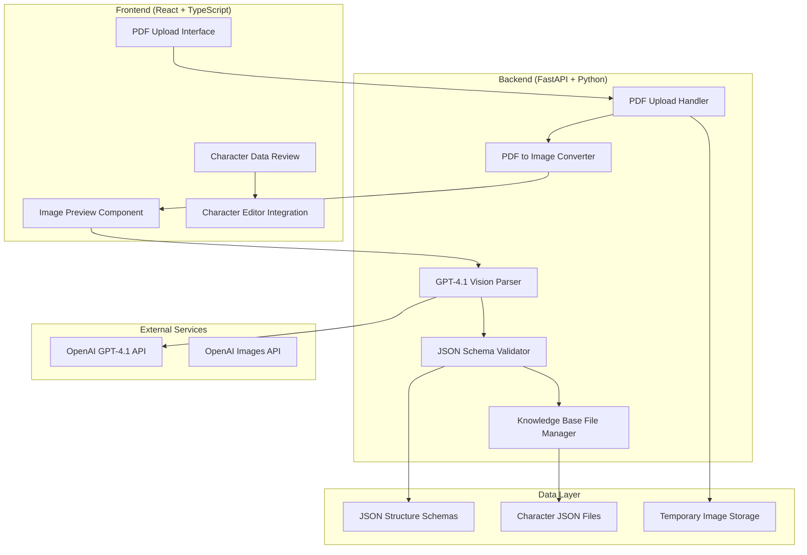

# Design Document

## Overview

The PDF Vision Modernization will transform the existing text-extraction-based PDF character import system into a modern vision-based approach using GPT-4.1's multimodal capabilities. This modernization eliminates complex PDF parsing libraries and leverages advanced AI vision to process character sheets as images, enabling support for handwritten sheets, complex layouts, and visual elements that text extraction cannot handle.

The design maintains full compatibility with existing JSON schemas and character management systems while significantly simplifying the codebase by removing all text extraction logic and replacing it with streamlined image processing and vision-based AI parsing.

## Architecture

### System Architecture Overview



### Key Architectural Changes

**Removed Components:**
- `PDFTextExtractor` class and all text extraction logic
- `PyPDF2` and `pdfplumber` dependencies
- Text-based LLM prompts and parsing logic
- PDF structure detection and text quality assessment

**New Components:**
- `PDFImageConverter` for converting PDF pages to images
- `VisionCharacterParser` using GPT-4.1 multimodal capabilities
- Image optimization and management utilities
- Vision-focused prompt engineering system

**Retained Components:**
- JSON schema validation and correction logic
- Character file management and creation
- Session management and cleanup
- Frontend character review and editing interfaces

## Components and Interfaces

### Backend Components

#### 1. PDF Image Converter Service

```python
class PDFImageConverter:
    def __init__(self):
        self.supported_formats = ['.pdf']
        self.max_file_size = 10 * 1024 * 1024  # 10MB
        self.image_format = 'PNG'
        self.image_quality = 95
        self.max_dimension = 2048  # Max width/height for API efficiency
    
    async def convert_pdf_to_images(self, file_path: str) -> PDFImageResult
    async def validate_pdf(self, file_path: str) -> bool
    def _optimize_image_for_api(self, image: Image) -> Image
    def _convert_to_base64(self, image: Image) -> str
    async def _upload_to_openai_files(self, image: Image) -> str
```

#### 2. Vision Character Parser Service

```python
class VisionCharacterParser:
    def __init__(self, openai_client, schema_validator):
        self.client = openai_client
        self.validator = schema_validator
        self.model = "gpt-4.1"  # Use GPT-4.1 for vision capabilities
        self.schema_loader = JSONSchemaLoader()
        
        # Define the 6 character file types for vision processing
        self.file_types = [
            "character",           # Basic character info, stats, AC, HP
            "spell_list",          # Spells and spellcasting information
            "feats_and_traits",    # Class features, racial traits, feats
            "inventory_list",      # Equipment, items, currency
            "action_list",         # Combat actions and attacks
            "character_background" # Background, personality, backstory
        ]
        # Note: objectives_and_contracts excluded (campaign-specific, not on character sheets)
    
    async def parse_character_data(self, images: List[str], session_id: str) -> CharacterParseResult
    async def parse_single_file_type(self, images: List[str], file_type: str) -> Tuple[Dict, List[UncertainField]]
    def _build_single_file_prompt(self, file_type: str) -> str
    def _validate_parsed_data(self, data: Dict, file_type: str) -> ValidationResult
    def _apply_schema_corrections(self, data: Dict, file_type: str) -> Dict
```

#### 3. PDF Import Session Manager (Updated)

```python
class PDFImportSessionManager:
    def __init__(self, temp_storage_path: str):
        self.temp_path = temp_storage_path
        self.sessions = {}
        self.cleanup_interval = 3600  # 1 hour
    
    async def create_session(self, user_id: str) -> str
    async def store_pdf_content(self, session_id: str, content: bytes) -> str
    async def store_converted_images(self, session_id: str, images: List[str])  # New method
    async def store_parsed_data(self, session_id: str, data: Dict)
    async def get_session_data(self, session_id: str) -> PDFImportSession
    async def cleanup_session(self, session_id: str)
```

#### 4. Updated API Routes

```python
# Updated endpoints for vision-based processing
@router.post("/upload")  # Now converts to images instead of extracting text
@router.get("/preview/{session_id}")  # Now shows image previews
@router.post("/parse")  # Now uses vision parsing
@router.post("/generate/{session_id}")  # Unchanged
@router.delete("/cleanup/{session_id}")  # Enhanced to clean up images
```

### Frontend Components

#### 1. Updated PDF Upload Component

```typescript
interface PDFUploadProps {
  onUploadComplete: (sessionId: string, imageCount: number) -> void;
  onError: (error: string) -> void;
}

export const PDFUpload: React.FC<PDFUploadProps>
```

#### 2. Image Preview Component (New)

```typescript
interface ImagePreviewProps {
  images: string[];  // Base64 or URLs
  onConfirm: () -> void;
  onReject: () -> void;
  onImageReorder: (newOrder: number[]) -> void;
}

export const ImagePreview: React.FC<ImagePreviewProps>
```

#### 3. Updated Character Data Review Component

```typescript
interface CharacterDataReviewProps {
  parsedData: ParsedCharacterData;
  uncertainFields: UncertainField[];
  originalImages: string[];  // For reference during review
  onFieldEdit: (filePath: string, fieldPath: string, value: any) -> void;
  onFinalize: (characterName: string) -> void;
  onReparse: () -> void;
}

export const CharacterDataReview: React.FC<CharacterDataReviewProps>
```

## Data Models

### Updated API Models

```python
class PDFImageResult(BaseModel):
    session_id: str
    images: List[str]  # Base64 encoded images or file IDs
    page_count: int
    image_format: str
    total_size_mb: float

class VisionParseResult(BaseModel):
    session_id: str
    character_files: Dict[str, Dict[str, Any]]
    uncertain_fields: List[UncertainField]
    parsing_confidence: float
    validation_results: Dict[str, ValidationResult]
    images_processed: int

class PDFImportSession(BaseModel):
    session_id: str
    user_id: str
    created_at: datetime
    pdf_filename: str
    converted_images: Optional[List[str]]  # Changed from extracted_text
    parsed_data: Optional[Dict[str, Dict]]
    status: str  # 'uploaded', 'converted', 'parsed', 'reviewed', 'completed'
```

### Frontend Types

```typescript
interface ImageData {
  id: string;
  base64: string;
  pageNumber: number;
  dimensions: { width: number; height: number };
}

interface VisionParseSession {
  sessionId: string;
  status: 'upload' | 'convert' | 'parse' | 'review' | 'finalize';
  progress: number;
  images?: ImageData[];
  parsedData?: ParsedCharacterData;
}
```

## Vision-Based LLM Integration Strategy

### OpenAI Responses API Integration

The system will use OpenAI's Responses API with GPT-4.1 for vision processing:

```python
async def _call_vision_api(self, images: List[str], prompt: str) -> str:
    """Call OpenAI Responses API with images and prompt."""
    
    # Prepare content with images and text
    content = [
        {"type": "input_text", "text": prompt}
    ]
    
    # Add images to content
    for image in images:
        if image.startswith('data:'):
            # Base64 data URL
            content.append({
                "type": "input_image", 
                "image_url": image
            })
        else:
            # File ID from Files API
            content.append({
                "type": "input_image", 
                "file_id": image
            })
    
    response = await self.client.responses.create(
        model="gpt-4.1",
        input=[{
            "role": "user",
            "content": content
        }]
    )
    
    return response.output_text
```

### Vision-Focused Prompt Engineering

#### 1. Character Basic Information Prompt
```
Analyze these D&D character sheet images and extract basic character information.

Look for:
- Character name (usually at the top)
- Race and class information
- Character level
- Ability scores (STR, DEX, CON, INT, WIS, CHA) - typically 6 numbers between 8-20
- Alignment (Lawful Good, Chaotic Evil, etc.)
- Background information

Pay special attention to:
- Handwritten text and numbers
- Form fields and checkboxes
- Tables and structured layouts
- Any crossed-out or corrected information

Return JSON matching this structure:
{character.json template}

Mark any uncertain extractions in the uncertainties array.
```

#### 2. Spell List Vision Prompt (Single File Focus)
```
Examine these character sheet images ONLY for spells and spellcasting information.

Look for:
- Spell lists (often in tables or organized sections)
- Spell names, levels (0-9), and schools of magic
- Cantrips (0-level spells) - often listed separately
- Spell slots and spellcasting statistics
- Spellcasting ability and save DC

Visual cues to watch for:
- Spell slot circles or checkboxes (filled/empty)
- Spell level headers or organization
- Prepared vs. known spell indicators
- Spellcasting ability scores highlighted

IGNORE: Class features, racial traits, equipment, or other non-spell information.

Return JSON matching this structure:
{spell_list.json template}
```

#### 3. Feats and Traits Vision Prompt (Separate Processing)
```
Examine these character sheet images ONLY for class features, racial traits, and feats.

Look for:
- Class features and abilities by level
- Racial traits and special abilities
- Chosen feats and their effects
- Passive abilities and resistances

Visual cues to watch for:
- Feature descriptions and mechanics
- Level-based ability unlocks
- Racial trait sections
- Feat selection areas

IGNORE: Spells, equipment, basic stats, or other non-feature information.

Return JSON matching this structure:
{feats_and_traits.json template}
```

#### 4. Inventory List Vision Prompt
```
Scan these character sheet images ONLY for equipment and inventory information.

Look for:
- Equipment lists and inventory sections
- Currency amounts (GP, SP, CP, etc.)
- Magic items and their properties
- Weight calculations and carrying capacity
- General items, tools, and gear

Visual elements to identify:
- Equipment tables and lists
- Checkboxes for equipped items
- Currency symbols and amounts
- Weight totals and encumbrance indicators
- Magic item descriptions or special formatting

IGNORE: Weapons with attack stats (those go in action_list), armor AC (goes in character), or other non-inventory information.

Return JSON matching this structure:
{inventory_list.json template}
```

#### 5. Action List Vision Prompt
```
Examine these character sheet images ONLY for combat actions and attacks.

Look for:
- Weapon attacks with attack bonuses and damage
- Combat actions and maneuvers
- Special attack abilities
- Bonus actions and reactions
- Action economy information

Visual elements to identify:
- Attack tables with to-hit bonuses
- Damage dice and modifiers
- Weapon properties and ranges
- Special combat abilities
- Action type indicators

IGNORE: Non-combat features, spells, or general equipment information.

Return JSON matching this structure:
{action_list.json template}
```

#### 6. Character Background Vision Prompt
```
Examine these character sheet images ONLY for background and personality information.

Look for:
- Background name (Acolyte, Criminal, Folk Hero, etc.)
- Personality traits, ideals, bonds, and flaws
- Backstory sections and narrative text
- Character description and appearance
- Personal history or character notes

Visual elements to identify:
- Background selection areas
- Personality trait text boxes
- Backstory narrative sections
- Character description fields
- Roleplay information areas

IGNORE: Combat stats, spells, equipment, or mechanical game information.

Return JSON matching this structure:
{character_background.json template}
```

### Single-File Processing Strategy

For each JSON file type, the system processes all images with a focused prompt:

1. **Sequential Processing**: Process one JSON file type at a time (character.json, then spell_list.json, etc.)
2. **Focused Prompts**: Each API call focuses on extracting data for only one specific JSON file
3. **Complete Image Set**: Send all character sheet images to each focused prompt for comprehensive extraction
4. **Independent Processing**: Each JSON file is generated independently to avoid cross-contamination
5. **Validation Per File**: Validate each JSON file against its specific schema before proceeding to the next

**Complete Processing Order (6 JSON Files):**
1. Send all images + character.json prompt → Generate character.json
2. Send all images + spell_list.json prompt → Generate spell_list.json  
3. Send all images + feats_and_traits.json prompt → Generate feats_and_traits.json
4. Send all images + inventory_list.json prompt → Generate inventory_list.json
5. Send all images + action_list.json prompt → Generate action_list.json
6. Send all images + character_background.json prompt → Generate character_background.json

Note: objectives_and_contracts.json is excluded from vision processing as it typically contains campaign-specific information not found on standard character sheets.

### Image Optimization Strategy

#### Image Processing Pipeline

1. **PDF Conversion**: Convert PDF pages to high-quality PNG images
2. **Resolution Optimization**: Resize images to optimal dimensions (max 2048px)
3. **Quality Enhancement**: Apply sharpening and contrast adjustments for text clarity
4. **Compression**: Balance file size with image quality for API efficiency
5. **Format Selection**: Use PNG for text-heavy images, JPEG for photo-like content

#### API Transmission Methods

The system will support multiple image transmission methods:

1. **Base64 Data URLs** (Primary): For immediate processing of smaller images
2. **OpenAI Files API** (Secondary): For larger images or batch processing
3. **Public URLs** (Fallback): If temporary hosting is needed

## Error Handling

### Image Processing Errors

1. **PDF Conversion Failures**
   - Corrupted or invalid PDF files
   - Password-protected or encrypted PDFs
   - PDFs with no visual content

2. **Image Quality Issues**
   - Low resolution or blurry scans
   - Poor contrast or lighting
   - Rotated or skewed pages

3. **Size and Format Limitations**
   - Images too large for API limits
   - Unsupported image formats
   - Network transmission failures

### Vision Processing Errors

1. **API Limitations**
   - Rate limiting and quota management
   - Image size restrictions
   - Model availability issues

2. **Recognition Failures**
   - Illegible handwriting
   - Complex layouts or formatting
   - Partially obscured content

3. **Data Quality Issues**
   - Inconsistent information across pages
   - Ambiguous or conflicting data
   - Missing required information

### User Experience Error Handling

1. **Progressive Enhancement**
   - Automatic image quality optimization
   - Multiple parsing attempts with different strategies
   - Clear feedback on processing status

2. **Graceful Degradation**
   - Highlight uncertain extractions for manual review
   - Provide editing capabilities for corrections
   - Fall back to manual character creation if needed

## Testing Strategy

### Backend Testing

1. **Unit Tests**
   - PDF to image conversion with various formats
   - Image optimization and compression
   - Vision prompt generation and response parsing
   - JSON schema validation and correction

2. **Integration Tests**
   - End-to-end vision-based import workflow
   - OpenAI API integration and error handling
   - Character file generation and validation
   - Session management and cleanup

3. **Performance Tests**
   - Large PDF file processing
   - Multiple image handling
   - API response time optimization
   - Memory usage during image processing

### Frontend Testing

1. **Component Tests**
   - Image preview and manipulation
   - Character data review with visual references
   - Progress tracking and status updates
   - Error state handling and recovery

2. **Integration Tests**
   - Complete vision-based import workflow
   - Image upload and preview functionality
   - Character data editing and validation
   - Navigation between workflow steps

3. **E2E Tests**
   - Various character sheet formats and layouts
   - Handwritten vs. printed sheet processing
   - Multi-page character sheet handling
   - Cross-browser image processing compatibility

## Security Considerations

### Image Processing Security

- **File Type Validation**: Strict PDF validation before conversion
- **Image Size Limits**: Prevent resource exhaustion from large images
- **Content Scanning**: Basic validation of image content appropriateness
- **Temporary Storage**: Secure handling and cleanup of image files

### API Security

- **Rate Limiting**: Implement appropriate limits for vision API calls
- **Input Sanitization**: Validate all data extracted from images
- **Error Information**: Avoid exposing sensitive details in error messages
- **Session Isolation**: Ensure image data is properly isolated between users

### Data Privacy

- **Image Retention**: Automatic cleanup of temporary images after processing
- **API Transmission**: Secure transmission of images to OpenAI
- **Session Management**: Proper isolation and cleanup of user sessions
- **Audit Logging**: Track image processing activities for security monitoring

## Performance Considerations

### Image Processing Optimization

- **Parallel Processing**: Convert multiple PDF pages simultaneously
- **Streaming Operations**: Process large files without loading entirely into memory
- **Caching Strategy**: Cache converted images during session lifetime
- **Compression Optimization**: Balance image quality with API transmission speed

### Vision API Optimization

- **Batch Processing**: Group related parsing tasks when possible
- **Request Optimization**: Minimize API calls through efficient prompt design
- **Response Caching**: Cache vision parsing results for identical images
- **Timeout Management**: Implement appropriate timeouts for vision processing

### Frontend Optimization

- **Image Loading**: Progressive loading and lazy loading of image previews
- **State Management**: Efficient handling of large image data in React state
- **Memory Management**: Proper cleanup of image data and canvas elements
- **User Feedback**: Real-time progress updates during long operations

## Migration Strategy

### Code Removal Plan

1. **Phase 1: Dependency Cleanup**
   - Remove PyPDF2 and pdfplumber from requirements.txt
   - Remove PDF text extraction imports and references
   - Clean up unused text processing utilities

2. **Phase 2: Service Replacement**
   - Replace PDFTextExtractor with PDFImageConverter
   - Update LLMCharacterParser to VisionCharacterParser
   - Modify API routes to handle images instead of text

3. **Phase 3: Frontend Updates**
   - Update upload component for image preview
   - Modify review interface to show original images
   - Update progress tracking for vision processing

4. **Phase 4: Testing and Validation**
   - Comprehensive testing with various character sheet formats
   - Performance validation and optimization
   - User acceptance testing and feedback integration

### Backward Compatibility

- **Session Data**: Graceful handling of existing text-based sessions
- **API Contracts**: Maintain existing API structure where possible
- **Character Files**: Full compatibility with existing JSON schemas
- **User Experience**: Seamless transition for end users

## Chat System Integration

### Default Character Context

To address Requirement 10, the chat system will be enhanced with character context management:

#### 1. Character Context Manager

```python
class CharacterContextManager:
    def __init__(self, knowledge_base_path: str):
        self.knowledge_base_path = knowledge_base_path
        self.default_character = None
        self.multi_player_mode = False
    
    async def set_default_character(self, character_name: str) -> bool
    async def get_default_character_data(self) -> Dict[str, Any]
    async def get_all_character_data(self) -> Dict[str, Dict[str, Any]]
    def toggle_multi_player_mode(self, enabled: bool)
    def get_chat_context(self) -> Dict[str, Any]
```

#### 2. Frontend Character Selection

```typescript
interface CharacterContextProps {
  defaultCharacter: string | null;
  multiPlayerMode: boolean;
  availableCharacters: string[];
  onDefaultCharacterChange: (character: string) -> void;
  onMultiPlayerToggle: (enabled: boolean) -> void;
}

export const CharacterContextSelector: React.FC<CharacterContextProps>
```

#### 3. Chat Integration

The chat system will be updated to:
- Load only default character data by default
- Provide a toggle for multi-player mode
- Include character context in chat prompts
- Maintain character selection state across sessions

This ensures focused, character-specific conversations while allowing flexibility for multi-character scenarios when needed.

## Schema Integration

### JSON Structure Compliance

The vision-based system maintains strict adherence to existing schemas:

1. **Schema Validation**: All vision-parsed data validated against existing schemas
2. **Template Merging**: Vision results merged with schema templates for completeness
3. **Error Correction**: Automatic correction of common vision parsing errors
4. **Compatibility**: Full compatibility with existing character editor and display systems

### Object-Based Design Preservation

The system continues to use general object structures:
- **Spell Objects**: Generic spell structure for any spellcasting class
- **Weapon Objects**: Standardized weapon properties and calculations
- **Feature Objects**: General feature structure for class/racial abilities
- **Item Objects**: Universal inventory item structure

This ensures that vision-processed characters integrate seamlessly with manually created characters and existing system functionality.